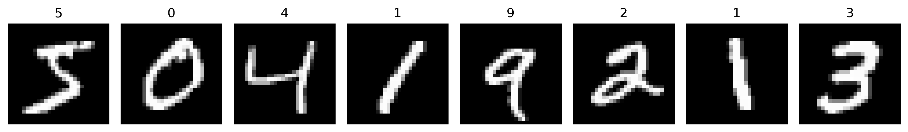
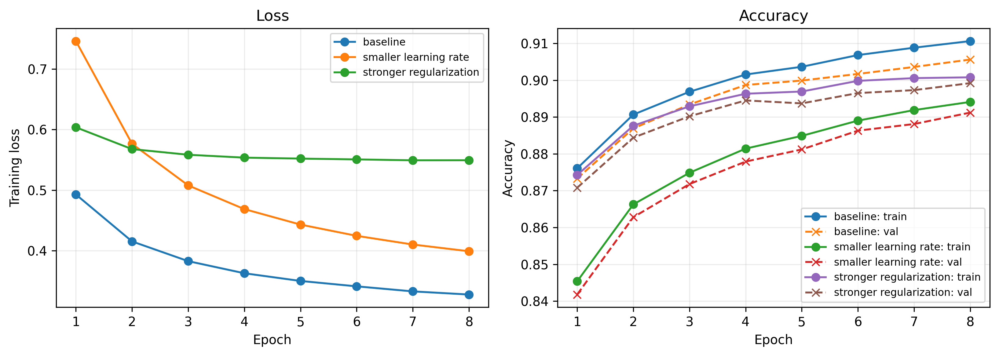

# Homework 1: Softmax for MNIST Classification

**Name:** 陈一铭 
**Student ID:** 2024012657
**Course:** Introduction to Deep Learning

## Honor Code: Use of AI

I used ChatGPT as a support tool while working on this homework. It helped me understand Python errors, find problems in indentation and file paths, and explain how to fix them. It also helped me use the Python `os` and `sys` modules to locate the data-loading script, read data from the correct folder, and save figures in the intended project directory. These changes were mainly for file management and did not change the MNIST split or the experimental settings.

I also referred to AI explanations and example code when completing the marked functions in the notebook. After running the notebook locally, I asked AI to check the implementation, gradient-check output, training logs, and final results.

For the final report, I used AI to convert my Markdown text into LaTeX and help compile it into a PDF. The conversion should preserve my content, equations, numerical results, and figure references, while improving the layout and fixing compilation errors. I remain responsible for understanding the code, checking the report, and following the course rules on independent work and AI assistance.

---

## 1. Aim and Experimental Setup

In this homework, I implemented a ten-class linear classifier for MNIST using NumPy. The model uses softmax probabilities, mean cross-entropy loss, L2 regularization, and mini-batch stochastic gradient descent (SGD).

Each MNIST image has 28 by 28 grayscale pixels. I flattened each image into 784 features and divided the pixel values by 255, so the input values are in the range [0, 1]. The input arrays use `float32`.

| Setting | Value |
| --- | --- |
| Training set | 50,000 images |
| Validation set | 10,000 images from the original 60,000-image training set |
| Test set | 10,000 separate images |
| Random seed | 2026 |
| Parameter initialization | Zero weights and zero biases |
| Training epochs | 8 for each configuration |
| Mini-batch size | 256 |
| Model selection | Highest validation accuracy at the final epoch |

I kept the supplied random split and seed. Each configuration started from a new set of zero parameters and used the same shuffling seed. Only the training set was used for parameter updates. The validation set was used to compare configurations, and the selected model was evaluated on the test set after selection.

*Figure 1. The first eight images from the original MNIST training set, with their labels.*

## 2. Model, Loss, and Gradient Derivation

### 2.1 Notation and Linear Scores

I use bold lowercase letters for vectors and bold uppercase letters for matrices. Scalar entries are not bold. The scalar symbols $B$, $D$, and $C$ denote batch size, number of features, and number of classes, respectively; here $D = 784$ and $C = 10$.

For one mini-batch, define

$$
\boldsymbol{X}\in\mathbb{R}^{B\times784},\qquad
\boldsymbol{W}\in\mathbb{R}^{784\times10},\qquad
\boldsymbol{b}\in\mathbb{R}^{10}.
$$

The input vector for image $i$ is $\boldsymbol{x}_i\in\mathbb{R}^{784}$, and its transpose is row $i$ of $\boldsymbol{X}$. The scalar label $y_i$ is an integer from 0 to 9. Define the one-hot label matrix $\boldsymbol{Y}\in\mathbb{R}^{B\times10}$ by

$$
Y_{ik}=\begin{cases}
1,&y_i=k,\\
0,&y_i\ne k,
\end{cases}
\qquad
\sum_{k=0}^{9}Y_{ik}=1.
$$

The score matrix is

$$
\boldsymbol{Z}=\boldsymbol{X}\boldsymbol{W}
+\boldsymbol{1}\boldsymbol{b}^{\top}
\in\mathbb{R}^{B\times10},
$$

where $\boldsymbol{1}\in\mathbb{R}^{B}$ is a vector of ones. For one score,

$$
Z_{ik}=\sum_{d=1}^{784}X_{id}W_{dk}+b_k.
$$

The lecture mainly places class weight vectors in the rows of its parameter matrix. This notebook places them in the columns of $\boldsymbol{W}$ to compute a batch as `X @ W`. The two conventions describe the same model, with transposed parameter matrices.

### 2.2 Softmax and Cross-Entropy

The probability of class $k$ for image $i$ is

$$
P_{ik}=\frac{\exp(Z_{ik})}{\sum_{j=0}^{9}\exp(Z_{ij})},
\qquad
\boldsymbol{P}\in\mathbb{R}^{B\times10}.
$$

The one-hot representation gives

$$
p(y_i\mid\boldsymbol{x}_i;\boldsymbol{W},\boldsymbol{b})
=\prod_{k=0}^{9}P_{ik}^{Y_{ik}}=P_{i,y_i}.
$$

Under the independent-sample assumption, maximizing the conditional likelihood is equivalent to minimizing the mean negative log-likelihood, or cross-entropy:

$$
E=-\frac{1}{B}\sum_{i=1}^{B}\sum_{k=0}^{9}Y_{ik}\log P_{ik}
=-\frac{1}{B}\sum_{i=1}^{B}\log P_{i,y_i}.
$$

The full objective required by the assignment is

$$
L(\boldsymbol{W},\boldsymbol{b})
=E+\frac{\lambda}{2}\lVert\boldsymbol{W}\rVert_F^2.
$$

Only the weights are regularized. The bias is not regularized, and the regularization term is not divided by $B$.

### 2.3 Local Gradient and Parameter Gradients

For one image, let

$$
E_i=-\sum_{k=0}^{9}Y_{ik}\log P_{ik}.
$$

The softmax derivative is

$$
\frac{\partial P_{ik}}{\partial Z_{ij}}
=P_{ik}(\delta_{kj}-P_{ij}),
$$

where the scalar $\delta_{kj}$ is 1 when $k = j$ and 0 otherwise. Applying the chain rule as in the lecture gives

$$
\begin{aligned}
\frac{\partial E_i}{\partial Z_{ij}}
&=-\sum_{k=0}^{9}\frac{Y_{ik}}{P_{ik}}
P_{ik}(\delta_{kj}-P_{ij})\\
&=-Y_{ij}+P_{ij}\sum_{k=0}^{9}Y_{ik}\\
&=P_{ij}-Y_{ij}.
\end{aligned}
$$

Therefore, the averaged local gradient is

$$
\frac{\partial L}{\partial\boldsymbol{Z}}
=\frac{\boldsymbol{P}-\boldsymbol{Y}}{B}.
$$

Since $\partial Z_{ik}/\partial W_{dk}=X_{id}$, the scalar weight derivative is

$$
\frac{\partial L}{\partial W_{dk}}
=\frac{1}{B}\sum_{i=1}^{B}X_{id}(P_{ik}-Y_{ik})+\lambda W_{dk}.
$$

The matrix form is

$$
\boxed{
\nabla_{\boldsymbol{W}}L
=\frac{1}{B}\boldsymbol{X}^{\top}(\boldsymbol{P}-\boldsymbol{Y})
+\lambda\boldsymbol{W}}
\in\mathbb{R}^{784\times10}.
$$

For the bias, $\partial Z_{ik}/\partial b_k=1$, so

$$
\frac{\partial L}{\partial b_k}
=\frac{1}{B}\sum_{i=1}^{B}(P_{ik}-Y_{ik}),
$$

or, in vector form,

$$
\boxed{
\nabla_{\boldsymbol{b}}L
=\frac{1}{B}(\boldsymbol{P}-\boldsymbol{Y})^{\top}\boldsymbol{1}}
\in\mathbb{R}^{10}.
$$

### 2.4 Numerical Stability

For each row, let $m_i=\max_j Z_{ij}$. Subtracting it does not change the probabilities because the common factor cancels:

$$
\frac{\exp(Z_{ik}-m_i)}{\sum_j\exp(Z_{ij}-m_i)}
=\frac{\exp(-m_i)\exp(Z_{ik})}
{\exp(-m_i)\sum_j\exp(Z_{ij})}
=P_{ik}.
$$

For finite scores, the shifted scores are nonpositive and at least one is zero. This prevents exponential overflow. However, a very small probability can still underflow to zero, so I compute log probabilities directly as

$$
\log P_{ik}
=(Z_{ik}-m_i)-\log\sum_{j=0}^{9}\exp(Z_{ij}-m_i),
$$

rather than taking the logarithm of the already computed probability.

### 2.5 Updates and Prediction

For each mini-batch, I update the parameters using the two gradients computed from the same old parameters:

$$
\boldsymbol{W}\leftarrow\boldsymbol{W}-\eta\nabla_{\boldsymbol{W}}L,
\qquad
\boldsymbol{b}\leftarrow\boldsymbol{b}-\eta\nabla_{\boldsymbol{b}}L,
$$

where the scalar $\eta$ is the learning rate. The predicted label is

$$
\hat{y}_i=\operatorname*{arg\,max}_{k\in\{0,\ldots,9\}}Z_{ik}.
$$

Softmax preserves the order of scores, so prediction does not need another softmax calculation. The model calculations are vectorized over images and classes; the training loops are only over epochs and mini-batches.

## 3. Implementation Checks

I kept the supplied extreme-score tests and finite-difference gradient check. All checks passed. The largest absolute errors between the analytical and numerical gradients were:

| Gradient | Largest absolute error |
| --- | --- |
| Weight gradient | $1.4417994576021442\times10^{-11}$ |
| Bias gradient | $1.5758033766744006\times10^{-11}$ |

The checker uses the central-difference approximation

$$
\frac{\partial L}{\partial\theta}
\approx\frac{L(\theta+h)-L(\theta-h)}{2h},
\qquad h=10^{-5},
$$

where $\theta$ is one scalar parameter. The small errors support the correctness of the implemented gradients. The extreme-score tests also passed, including the finite-loss check when the true class has a very low probability.

## 4. Results

### 4.1 Hyperparameter Comparison

I used the three supplied configurations. Comparing baseline with the smaller-learning-rate run keeps regularization fixed. Comparing baseline with the stronger-regularization run keeps the learning rate fixed. All other training settings are the same.

| Configuration | Learning rate | $\lambda$ | Final training loss | Final training accuracy | Final validation accuracy |
| --- | ---: | ---: | ---: | ---: | ---: |
| baseline | 0.10 | $10^{-4}$ | 0.3278 | 91.06% | **90.56%** |
| smaller learning rate | 0.03 | $10^{-4}$ | 0.3992 | 89.41% | 89.12% |
| stronger regularization | 0.10 | $10^{-2}$ | 0.5493 | 90.08% | 89.92% |

Here, training loss means the full objective, including the L2 penalty, evaluated on the whole training set after the final epoch.

*Figure 2. Learning curves for the three configurations. The left panel shows training loss, and the right panel shows training and validation accuracy.*

### 4.2 Selected Model and Final Test

The baseline configuration had the highest final validation accuracy, so I selected it before the test evaluation.

| Item | Result |
| --- | --- |
| Selected configuration | baseline |
| Learning rate | 0.10 |
| Regularization coefficient | $10^{-4}$ |
| Final training accuracy | 91.06% |
| Final validation accuracy | 90.56% |
| Final test accuracy | **91.43%** |

The test result was obtained after configuration selection. The test set was not used in training or in the configuration-selection code.

## 5. Discussion

1. With $\lambda=10^{-4}$ fixed, a learning rate of 0.10 reduced the loss faster than 0.03 and gave a final validation accuracy that was 1.44 percentage points higher within the same eight-epoch budget; this does not show that 0.03 would remain worse with longer training. 
2. At a fixed learning rate of 0.10, increasing $\lambda$ to $10^{-2}$ lowered both training and validation accuracy, with validation accuracy decreasing by 0.64 percentage points, so stronger regularization did not improve validation performance in this experiment. 
3. The baseline training-validation gap was only 0.50 percentage points, which does not suggest strong overfitting, while its continuing improvement at epoch 8 means that training may not yet be fully converged. 
4. The stronger-regularization loss changed slightly from 0.5492 to 0.5493 in the last epoch, which is not unusual for mini-batch SGD, and total losses with different penalty coefficients should not be treated as direct comparisons of cross-entropy alone. 
5. A limitation of this model is that it learns linear decision boundaries in the original pixel space and does not explicitly handle image translation or complex spatial patterns. 
6. The selected model reached 91.43% test accuracy, slightly above its validation accuracy, which is possible because the validation and test sets contain different images.

## 6. Sources

1. Course-provided *Homework 1: Softmax for MNIST Classification* instructions, notebook, and `mnist_data_loader.py`.
2. Course-provided *Lecture 3: Regression and Classification*, especially pages 27, 30-34, and 36-44.
3. ChatGPT assistance, as described in the Honor Code above.

